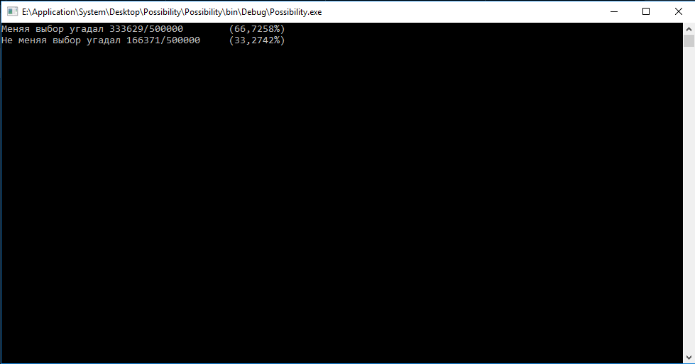

#### Цель программы -- проверить парадокс _Монти Холла_* (симуляция).
Из симуляции видно, что парадокс однозначно работает.

### Описание парадокса
***Парадокс Монти Холла** — одна из известных задач теории вероятностей, решение которой, на первый взгляд, противоречит здравому смыслу. Эта задача не является парадоксом в узком смысле этого слова, так как не содержит в себе противоречия, она называется парадоксом потому, что её решение может показаться неожиданным. Более того, многим людям бывает сложно принять правильное решение даже после того, как его им рассказали.

### Формулировка
Задача формулируется как описание игры:
>Представьте, что вы стали участником игры, в которой вам нужно выбрать одну из трёх дверей. За одной из дверей находится автомобиль, за двумя другими дверями — козы. Вы выбираете одну из дверей, например, номер 1, после этого ведущий, который знает, где находится автомобиль, а где — козы, открывает одну из оставшихся дверей, например, номер 3, за которой находится коза. После этого он спрашивает вас — не желаете ли вы изменить свой выбор и выбрать дверь номер 2? Увеличатся ли ваши шансы выиграть автомобиль, если вы примете предложение ведущего и измените свой выбор?

Наиболее популярной является задача с дополнительным условием — участнику игры заранее известны следующие правила:

* Aвтомобиль равновероятно размещён за любой из трёх дверей;
* Ведущий знает, где находится автомобиль;
* Ведущий в любом случае обязан открыть дверь с козой (но не ту, которую выбрал игрок) и предложить игроку изменить выбор;
* Если у ведущего есть выбор, какую из двух дверей открыть, он выбирает любую из них с одинаковой вероятностью.
